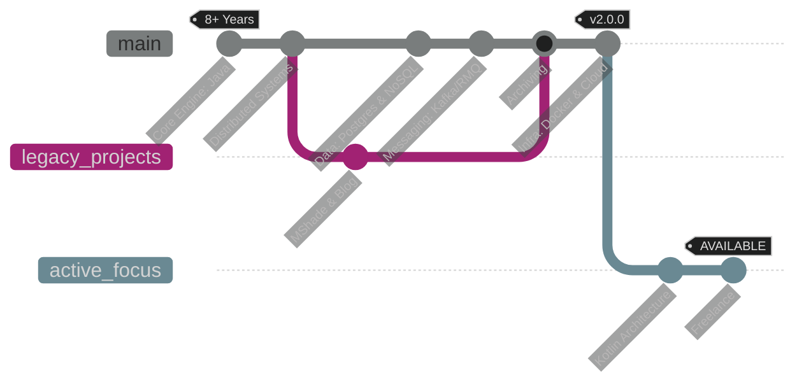

  <h1>Oleksandr</h1>
  
<b>Backend Engineer | 8+ Years Experience | Ukraine 🇺🇦</b>

  
<i>Building resilient distributed systems and exploring new paradigms.</i>

  
  
    

   
  

  <h3>🚀 Current Tech Stack</h3>
  
Focusing on high-availability and scalable JVM architectures.

   

  <!-- Line 1 -->
  
  
  
  
   
  <!-- Line 2 -->
  
  
  
  

